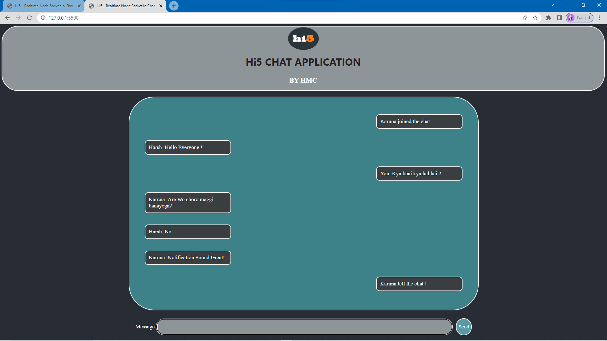

# Hi5 - Realtime Chatting Application

Hi5 is a realtime chatting application built using Node.js and Socket.io. It allows multiple users to chat simultaneously and provides notification sounds for incoming messages. The application generates messages to notify users when someone joins or leaves the chat.

## Technologies Used
- Node.js
- Socket.io
- HTML
- CSS
- JavaScript

## Features
- Realtime Chat: Users can send and receive messages in realtime.
- Multiple Users: Multiple users can join the chat and communicate with each other.
- Notification Sound: The application plays a notification sound when a new message is received.
- User Join/Leave Notifications: Messages are generated to notify other users when someone joins or leaves the chat.

## Installation
1. Clone the repository: `git clone < https://github.com/HARSHMISHRA-521/WEB_DEV_PROJECTS/tree/master/CHAT%20APP >`

2. Navigate to the project directory: `cd hi5-chat-application`

3. Install the dependencies:  `npm install`

## Usage
1. Start the server: `npm start`
2. Open your web browser and navigate to `http://localhost:8080`
3. Enter your name to join the chat and start chatting with other users.

## Author
Hi5 is developed by Harsh Mishra.

## Screenshots

---

A HMC
