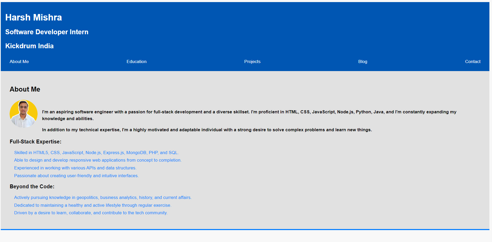
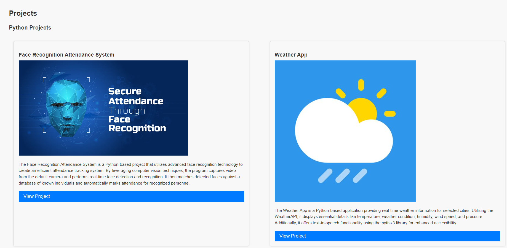
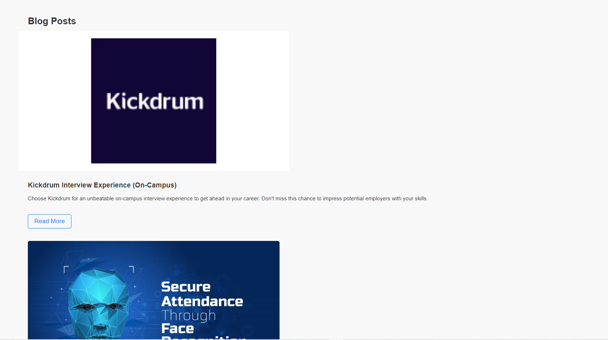
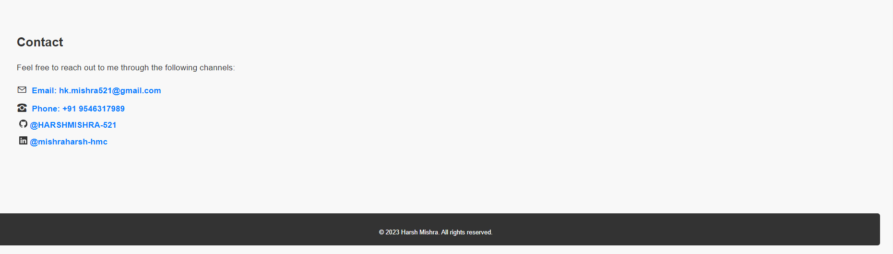

# My Personal Portfolio

This website is my personal portfolio, developed by Harsh Mishra. It showcases my skills, experience, and projects to potential employers and collaborators.

## Features

- **Responsive design:** The website is optimized for all devices, from desktops to mobile phones.
- **Clean and modern design:** The design is simple and easy to navigate, with a focus on user experience.
- **Detailed information:** The website provides detailed information about my skills, experience, and projects, with links to relevant websites and repositories.
- **Contact form:** Visitors can easily contact me through a contact form.

## Technologies Used

This website was developed using the following technologies:

- **Front-end:** HTML, CSS

## Contributions

I am always open to contributions to this project. If you find any bugs or have any suggestions for improvement, please feel free to create an issue or pull request on GitHub.

## License

This project is licensed under the [HMC_PROJECTS].

## Author

**Harsh Mishra**

- LINKEDIN: [mishraharsh-hmc]
- GitHub: [github.com/HARSHMISHRA-521]
- Email: [hk.mishra521@gmail.com]

